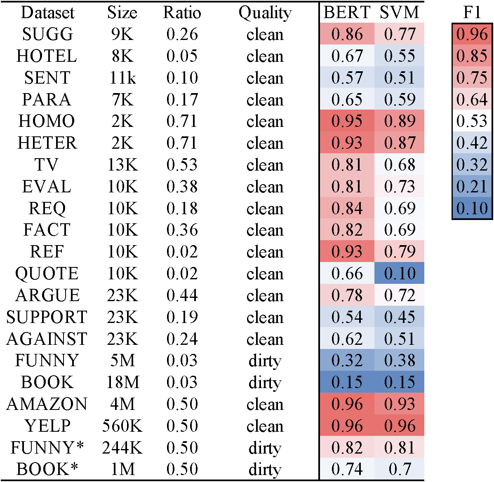

# 🔥 Semantic Tagging Benchmark
A tool box of deep and simple models for semantic tagging (e.g. [Tips from customer reviews at Amazon](https://www.amazon.com/Steam-Mop-Cleaner-ThermaPro-System/dp/B077S6KQ88/ref=sr_1_3_sspa?dchild=1&keywords=steam+mop&qid=1623340919&sr=8-3-spons&psc=1&spLa=ZW5jcnlwdGVkUXVhbGlmaWVyPUExUlA3WDdKRDU2SEVBJmVuY3J5cHRlZElkPUEwNDc3ODYzMk9JWUw1MldGU01JNyZlbmNyeXB0ZWRBZElkPUEwMjA5MzA4MUhXU1ozRlEyUExLMCZ3aWRnZXROYW1lPXNwX2F0ZiZhY3Rpb249Y2xpY2tSZWRpcmVjdCZkb05vdExvZ0NsaWNrPXRydWU=))

There are 21 distinctive datasets that contain open labels for various tagging tasks 

The datasets can be used for broader NLP tasks including text/intent classification and information extraction

## Dataset

| Dataset | #Record | %Positive | Quality | Task       |
|---------|---------|-----------|---------|------------|
| SUGG    | 9K      | 0.26      | clean   | Tip        |
| HOTEL   | 8K      | 0.05      | clean   | Tip        |
| SENT    | 11k     | 0.10      | clean   | Tip        |
| PARA    | 7K      | 0.17      | clean   | Tip        |
| HOMO    | 2K      | 0.71      | clean   | Humor      |
| HETER   | 2K      | 0.71      | clean   | Humor      |
| FUNNY   | 5M      | 0.03      | dirty   | Humor      |
| FUNNY\* | 244K    | 0.50      | dirty   | Humor      |
| TV      | 13K     | 0.53      | clean   | Spoiler    |
| BOOK    | 18M     | 0.03      | dirty   | Spoiler    |
| BOOK\*  | 1M      | 0.50      | dirty   | Spoiler    |
| EVAL    | 10K     | 0.38      | clean   | Argument   |
| REQ     | 10K     | 0.18      | clean   | Argument   |
| FACT    | 10K     | 0.36      | clean   | Argument   |
| REF     | 10K     | 0.02      | clean   | Argument   |
| QUOTE   | 10K     | 0.02      | clean   | Argument   |
| ARGUE   | 23K     | 0.44      | clean   | Argument   |
| SUPPORT | 23K     | 0.19      | clean   | Argument   |
| AGAINST | 23K     | 0.24      | clean   | Argument   |
| AMAZON  | 4M      | 0.50      | clean   | Sentiment  |
| YELP    | 560K    | 0.50      | clean   | Sentiment  |

## Model
- BERT (Bidirectional Encoder representations from Transformers)
- LSTM (Long Short-Term Memory)
- CNN (Convolutional Neural Network)
- LR (Logistic Regression)
- SVM (Support Vector Machine)

## Appendix Model
- ALBERT (A Lite BERT)
- ROBERTA (A Robustly Optimized BERT Pretraining Approach)
- NB (Naive Bayes)
- XGboost (A Scalabel Tree Boosting System)

## Dependency
- pytorch 1.2.0
- pytorch-pretrained-bert 0.6.2
- scikit-learn 0.23.1
- transformers 2.3.0
- xgboost 1.1.0

## Research Usage or Experiment
-Step 1: clone the repository

    git clone --recursive https://github.com/rit-git/tagging.git

    cd tagging

-Step 2: install dependency

    pip install -r requirements.txt

-Step 3: prepare dataset 
    
    cd ./data/SUGG

    sh download.sh

    cd ../../

-Step 4: evaluate models

    cd script
    
    sh bert.sh

    cat result/bert.csv

-Step 5: More deep and simple models can be found under folders script/ and appendix/

## Main Results


## Non-programmer Usage

-Step 1 - 3: same as Research Usage 

-Step 4: install
    
    pip install -e .

    export TAGGING_HOME=`pwd`
    
-Step 5: train a BERT model (e.g. using SUGG for Tip Mining)

    tagging finetune ./data/SUGG/train.csv ./SUGG_model

-Step 6: predict (e.g. on your dataset) using trained model

    tagging estimate ./data/SUGG/dev.csv ./SUGG_model -o result.csv

-Step 7: evaluate predictions
    
    tagging evaluate --metric f1 ./result.csv 3 6

-Step 8: More information about the tagging command can be found at result.csv or by

    tagging --help

    tagging evaluate --help

## Programmer Usage

-Step 1 - 3: same as Research Usage 

-Step 4: set up

    export TAGGING_HOME=`pwd`

-Step 5: programming in python

```python
import sys
import os
sys.path.insert(0, os.environ['TAGGING_HOME'] + "/pyfunctor")
import csv_handler as csv_handler
from nlp.bert_predict import BertModel

# train a model
train_set = csv_handler.csv_readlines('./data/SUGG/train.csv')
model = BertModel('bert-base-uncased')
model.train(train_set, num_epoch = 3)

# deploy the trained model on your dataset
your_dataset = csv_handler.csv_readlines('./data/SUGG/dev.csv')
pred = model.predict(your_dataset)
```
-Step 6: each row of pred is [score\_neg, score\_pos, argmax_class, text] 

## Citation
We will be thrilled if you find this repository helpful and cite the following paper: 

**[Deep or Simple models for Semantic Tagging? It Depends on your Data (PVLDB 2020 Sep., Tokyo)](http://www.vldb.org/pvldb/vol13/p2549-li.pdf)**

    @article{DBLP:journals/pvldb/LiL0T20,
        author    = {Jinfeng Li and
                     Yuliang Li and
                     Xiaolan Wang and
                     Wang{-}Chiew Tan},
        title     = {Deep or Simple Models for Semantic Tagging? It Depends on your Data},
        journal   = {Proc. {VLDB} Endow.},
        volume    = {13},
        number    = {11},
        pages     = {2549--2562},
        year      = {2020},
        url       = {http://www.vldb.org/pvldb/vol13/p2549-li.pdf},
        timestamp = {Tue, 24 Nov 2020 14:44:02 +0100},
        biburl    = {https://dblp.org/rec/journals/pvldb/LiL0T20.bib},
        bibsource = {dblp computer science bibliography, https://dblp.org}

## Contact

If you have any questions or suggestions, please submit a Github issue or contact Jinfeng Li (jinfeng@megagon.ai)
